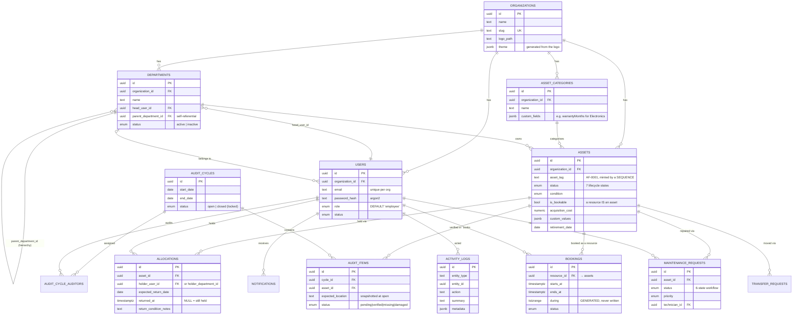

# AssetFlow — Database Schema

**14 tables · 11 native enums · 2 constraints that make the two hardest business
rules impossible to violate.**

The schema is the centre of this project. Everything else — the API, the screens,
the real-time updates — is a consequence of getting this right. This document
explains not just *what* the tables are, but *why* each decision was made, because
most of them had a plausible alternative that would have been worse.

Source of truth: [`backend/src/db/schema/`](../backend/src/db/schema/).
Migrations: [`backend/src/db/migrations/`](../backend/src/db/migrations/).

---

## 1. The two showpieces

These are the rules the spec cares most about, and they are enforced by
**PostgreSQL**, not by application code.

### One asset, one holder

```sql
CREATE UNIQUE INDEX one_active_allocation
  ON allocations (asset_id)
  WHERE (returned_at IS NULL);
```

`returned_at IS NULL` means "still held". The index is **partial**, so it permits
unlimited *returned* allocations per asset — that is the history — while allowing
exactly **one open one**.

**Why not check in the service layer?** Because a `SELECT ... WHERE returned_at IS
NULL` followed by an `INSERT` is a race. Two concurrent requests both see the
laptop as free, both insert, and the laptop is now held by two people. There is no
amount of application code that closes that window; only the database can, because
only the database can make the check and the write atomic.

So the service does **not** pre-check. It attempts the insert and lets Postgres
refuse it:

```
POST /api/allocations   (AF-0114 → Raj, while Priya holds it)

409 ASSET_ALREADY_ALLOCATED
"AF-0114 is currently held by Priya Sharma. Direct re-allocation is blocked —
 submit a transfer request instead."
details.holder = { name: "Priya Sharma", department: "Engineering" }
```

The holder lookup happens *after* the refusal — for the message, not for the
decision. **The database decides; the application explains.**

### No overlapping bookings

```sql
CREATE EXTENSION btree_gist;

ALTER TABLE bookings ADD COLUMN during tstzrange
  GENERATED ALWAYS AS (tstzrange(starts_at, ends_at, '[)')) STORED;

ALTER TABLE bookings ADD CONSTRAINT no_overlap
  EXCLUDE USING gist (resource_id WITH =, during WITH &&)
  WHERE (status <> 'cancelled');
```

Three things are doing work here.

**`btree_gist`** is required because the constraint mixes an equality operator
(`resource_id WITH =`) with a range-overlap operator (`during WITH &&`) in one GiST
index. Core GiST cannot do the scalar half.

**`during` is a GENERATED column.** The application writes only `starts_at` and
`ends_at`; Postgres derives the range itself on every write. It therefore *cannot*
drift out of sync with the columns it is built from — which a trigger-maintained
column eventually would.

**`'[)'` is a half-open range** — start inclusive, end exclusive. That single
character pair is the entire difference between a correct booking system and one
that rejects every back-to-back meeting:

| Existing | Requested | Result |
|---|---|---|
| 09:00–10:00 | 09:30–10:30 | **rejected** — the ranges overlap |
| 09:00–10:00 | 10:00–11:00 | **accepted** — they touch, but do not overlap |

And `WHERE (status <> 'cancelled')` means cancelling a booking frees its slot the
instant the status flips — **without deleting the row**, so the history and the
reports survive.

---

## 2. The ER diagram



---

## 3. The decisions worth defending

### A bookable resource is an asset, not a second table

`bookings.resource_id → assets.id`, and an asset is bookable when
`is_bookable = true`.

The spec says an asset is "marked as a shared bookable resource" — that is a flag,
not a different kind of thing. A separate `resources` table would duplicate tag,
location, condition and status, and then Room B2 could not have a maintenance
request or appear in an audit. **One source of truth, and a room behaves like the
asset it is.**

### `activity_logs` is one append-only table serving three features

The Activity Log screen, the dashboard's Recent Activity, **and every asset's
lifecycle timeline** are all queries over this one table. Every mutation writes to
it through a single helper.

The timeline is therefore not a feature to maintain — it is a **query over history
we were already recording**. There is no timeline table, no timeline writer, and
nothing that can disagree with what actually happened.

### Asset tags are minted by a SEQUENCE

```sql
CREATE SEQUENCE asset_tag_seq START 1;
ALTER TABLE assets ALTER COLUMN asset_tag
  SET DEFAULT 'AF-' || lpad(nextval('asset_tag_seq')::text, 4, '0');
```

The obvious approach — read the highest tag, add one — is a race: two concurrent
registrations both read `AF-0007` and both try to write `AF-0008`. `nextval()` is
atomic, so collisions are impossible by construction.

### Native enums, not free-text with CHECKs

11 `pgEnum` types. An invalid status cannot exist in the data — not through the
API, not through a stray `psql` session, not through a bad migration.

### Multi-tenancy from day one

Every core table carries `organization_id`. Retrofitting tenancy means touching
every query in the system and finding the ones you missed in production.

### The department hierarchy needs a cycle guard the FK cannot express

`parent_department_id` is self-referential. A foreign key cannot say "not your own
ancestor", so a **recursive CTE** checks it on every re-parent. Without it, any
recursive walk of the org chart would spin forever.

---

## 4. Every table

| Table | Rows about | Notable |
|---|---|---|
| `organizations` | the tenant | `theme jsonb` generated from the uploaded logo |
| `departments` | the org chart | self-referential parent; cycle-guarded |
| `asset_categories` | grouping | `custom_fields jsonb` → per-category extra fields |
| `users` | people | `role` DEFAULTs to `employee`; unique email **per org** |
| `assets` | the estate | tag from a sequence; `is_bookable` makes it a resource |
| `allocations` | who holds what | **`one_active_allocation`**; CHECK: a holder must exist |
| `transfer_requests` | the way around the block | Requested → Approved → Re-allocated |
| `bookings` | resources over time | **`no_overlap`**; generated `during` range |
| `maintenance_requests` | repairs | 6-state machine; approval gate |
| `audit_cycles` | verification passes | closing **locks** the cycle |
| `audit_cycle_auditors` | M2M | the spec says "one **or more** auditors" |
| `audit_items` | the checklist | expected location **snapshotted** at open |
| `notifications` | one person's feed | `read_at IS NULL` = the bell's badge |
| `activity_logs` | who did what, when | append-only; powers 3 features |

## 5. Enums

| Enum | Values |
|---|---|
| `user_role` | admin, asset_manager, department_head, employee |
| `asset_status` | available, allocated, reserved, under_maintenance, lost, retired, disposed |
| `asset_condition` | new, good, fair, poor, damaged |
| `transfer_status` | requested, approved, rejected, reallocated |
| `booking_status` | upcoming, ongoing, completed, cancelled |
| `maintenance_status` | pending, approved, rejected, technician_assigned, in_progress, resolved |
| `priority` | low, medium, high, critical |
| `audit_cycle_status` | open, closed |
| `audit_item_status` | pending, verified, missing, damaged |
| `entity_status` | active, inactive |
| `notification_type` | 9 values, one per spec'd event |

---

## 6. Proving it

The constraints are covered by tests that run against a **real PostgreSQL** — a
test that mocked the database would prove nothing, because the guarantees *live* in
the database.

```bash
cd backend && bun test
```

```
✓ rejects a second active allocation of AF-0114        (23505 / one_active_allocation)
✓ allows re-allocation once the asset is returned      (the partial index releases)
✓ requires a holder — an allocation to nobody          (23514 / allocation_has_a_holder)
✓ rejects 09:30–10:30 against an existing 09:00–10:00  (23P01 / no_overlap)
✓ accepts 10:00–11:00 — touching endpoints don't overlap
✓ rejects a booking that fully contains the existing one
✓ rejects a booking strictly inside the existing one
✓ allows the identical slot on a DIFFERENT resource
✓ cancelling frees the slot without deleting the row
✓ rejects a zero-length booking
✓ rejects a booking that ends before it starts
```

Or see them in the database directly:

```bash
docker compose exec postgres psql -U assetflow -d assetflow -c '\d bookings'
docker compose exec postgres psql -U assetflow -d assetflow -c '\d allocations'
```
